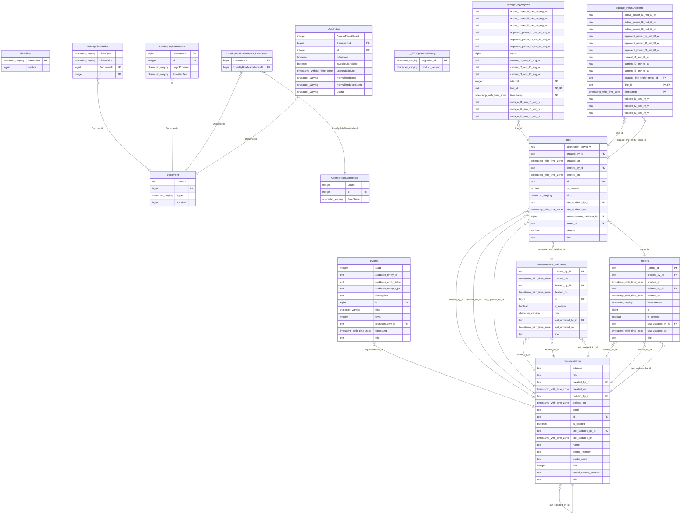

```mermaid
erDiagram
    Document {
        text Content 
        bigint Id PK 
        character_varying Type 
        bigint Version 
    }

    Identifiers {
        character_varying dimension PK 
        bigint nextval 
    }

    UserByClaimIndex {
        character_varying ClaimType 
        character_varying ClaimValue 
        bigint DocumentId FK 
        integer Id PK 
    }

    UserByLoginInfoIndex {
        bigint DocumentId FK 
        integer Id PK 
        character_varying LoginProvider 
        character_varying ProviderKey 
    }

    UserByRoleNameIndex {
        integer Count 
        integer Id PK 
        character_varying RoleName 
    }

    UserByRoleNameIndex_Document {
        bigint DocumentId FK 
        bigint UserByRoleNameIndexId FK 
    }

    UserIndex {
        integer AccessFailedCount 
        bigint DocumentId FK 
        integer Id PK 
        boolean IsEnabled 
        boolean IsLockoutEnabled 
        timestamp_without_time_zone LockoutEndUtc 
        character_varying NormalizedEmail 
        character_varying NormalizedUserName 
        character_varying UserId 
    }

    __EFMigrationsHistory {
        character_varying migration_id PK 
        character_varying product_version 
    }

    egauge_aggregates {
        real active_power_l1_net_t0_avg_w 
        real active_power_l2_net_t0_avg_w 
        real active_power_l3_net_t0_avg_w 
        real apparent_power_l1_net_t0_avg_w 
        real apparent_power_l2_net_t0_avg_w 
        real apparent_power_l3_net_t0_avg_w 
        bigint count 
        real current_l1_any_t0_avg_a 
        real current_l2_any_t0_avg_a 
        real current_l3_any_t0_avg_a 
        integer interval PK 
        text line_id PK,FK 
        timestamp_with_time_zone timestamp PK 
        real voltage_l1_any_t0_avg_v 
        real voltage_l2_any_t0_avg_v 
        real voltage_l3_any_t0_avg_v 
    }

    egauge_measurements {
        real active_power_l1_net_t0_w 
        real active_power_l2_net_t0_w 
        real active_power_l3_net_t0_w 
        real apparent_power_l1_net_t0_w 
        real apparent_power_l2_net_t0_w 
        real apparent_power_l3_net_t0_w 
        real current_l1_any_t0_a 
        real current_l2_any_t0_a 
        real current_l3_any_t0_a 
        text egauge_line_entity_string_id FK 
        text line_id PK,FK 
        timestamp_with_time_zone timestamp PK 
        real voltage_l1_any_t0_v 
        real voltage_l2_any_t0_v 
        real voltage_l3_any_t0_v 
    }

    events {
        integer audit 
        text auditable_entity_id 
        text auditable_entity_table 
        text auditable_entity_type 
        text description 
        bigint id PK 
        character_varying kind 
        integer level 
        text representative_id FK 
        timestamp_with_time_zone timestamp 
        text title 
    }

    lines {
        real connection_power_w 
        text created_by_id FK 
        timestamp_with_time_zone created_on 
        text deleted_by_id FK 
        timestamp_with_time_zone deleted_on 
        text id PK 
        boolean is_deleted 
        character_varying kind 
        text last_updated_by_id FK 
        timestamp_with_time_zone last_updated_on 
        bigint measurement_validator_id FK 
        text meter_id FK 
        ARRAY phases 
        text title 
    }

    measurement_validators {
        text created_by_id FK 
        timestamp_with_time_zone created_on 
        text deleted_by_id FK 
        timestamp_with_time_zone deleted_on 
        bigint id PK 
        boolean is_deleted 
        character_varying kind 
        text last_updated_by_id FK 
        timestamp_with_time_zone last_updated_on 
        text title 
    }

    meters {
        text _string_id PK 
        text created_by_id FK 
        timestamp_with_time_zone created_on 
        text deleted_by_id FK 
        timestamp_with_time_zone deleted_on 
        character_varying discriminator 
        bigint id 
        boolean is_deleted 
        text last_updated_by_id FK 
        timestamp_with_time_zone last_updated_on 
        text title 
    }

    representatives {
        text address 
        text city 
        text created_by_id FK 
        timestamp_with_time_zone created_on 
        text deleted_by_id FK 
        timestamp_with_time_zone deleted_on 
        text email 
        text id PK 
        boolean is_deleted 
        text last_updated_by_id FK 
        timestamp_with_time_zone last_updated_on 
        text name 
        text phone_number 
        text postal_code 
        integer role 
        text social_security_number 
        text title 
    }

    UserByClaimIndex }o--|| Document : "DocumentId"
    UserByLoginInfoIndex }o--|| Document : "DocumentId"
    UserByRoleNameIndex_Document }o--|| Document : "DocumentId"
    UserIndex }o--|| Document : "DocumentId"
    UserByRoleNameIndex_Document }o--|| UserByRoleNameIndex : "UserByRoleNameIndexId"
    egauge_aggregates }o--|| lines : "line_id"
    egauge_measurements }o--|| lines : "line_id"
    egauge_measurements }o--|| lines : "egauge_line_entity_string_id"
    events }o--|| representatives : "representative_id"
    lines }o--|| measurement_validators : "measurement_validator_id"
    lines }o--|| meters : "meter_id"
    lines }o--|| representatives : "created_by_id"
    lines }o--|| representatives : "deleted_by_id"
    lines }o--|| representatives : "last_updated_by_id"
    measurement_validators }o--|| representatives : "created_by_id"
    measurement_validators }o--|| representatives : "deleted_by_id"
    measurement_validators }o--|| representatives : "last_updated_by_id"
    meters }o--|| representatives : "created_by_id"
    meters }o--|| representatives : "deleted_by_id"
    meters }o--|| representatives : "last_updated_by_id"
    representatives }o--|| representatives : "created_by_id"
    representatives }o--|| representatives : "deleted_by_id"
    representatives }o--|| representatives : "last_updated_by_id"
```