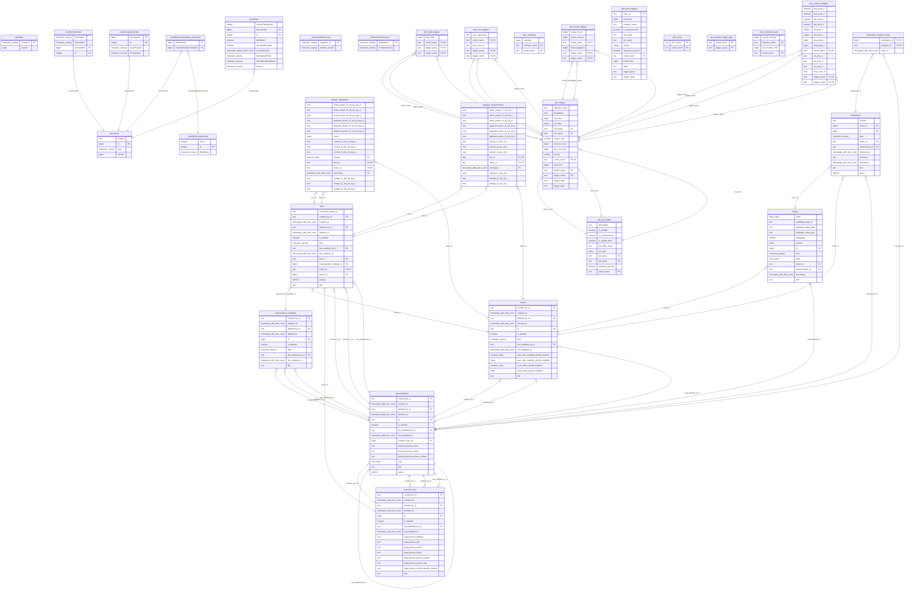

# Database schema

```mermaid
erDiagram
    Document {
        text Content 
        bigint Id PK 
        character_varying Type 
        bigint Version 
    }

    Identifiers {
        character_varying dimension PK 
        bigint nextval 
    }

    UserByClaimIndex {
        character_varying ClaimType 
        character_varying ClaimValue 
        bigint DocumentId FK 
        integer Id PK 
    }

    UserByLoginInfoIndex {
        bigint DocumentId FK 
        integer Id PK 
        character_varying LoginProvider 
        character_varying ProviderKey 
    }

    UserByRoleNameIndex {
        integer Count 
        integer Id PK 
        character_varying RoleName 
    }

    UserByRoleNameIndex_Document {
        bigint DocumentId FK 
        bigint UserByRoleNameIndexId FK 
    }

    UserIndex {
        integer AccessFailedCount 
        bigint DocumentId FK 
        integer Id PK 
        boolean IsEnabled 
        boolean IsLockoutEnabled 
        timestamp_without_time_zone LockoutEndUtc 
        character_varying NormalizedEmail 
        character_varying NormalizedUserName 
        character_varying UserId 
    }

    __EnmsDataDbContext {
        character_varying migration_id PK 
        character_varying product_version 
    }

    __EnmsJobsDbContext {
        character_varying MigrationId PK 
        character_varying ProductVersion 
    }

    egauge_aggregates {
        real active_power_l1_net_t0_avg_w 
        real active_power_l2_net_t0_avg_w 
        real active_power_l3_net_t0_avg_w 
        real apparent_power_l1_net_t0_avg_w 
        real apparent_power_l2_net_t0_avg_w 
        real apparent_power_l3_net_t0_avg_w 
        bigint count 
        real current_l1_any_t0_avg_a 
        real current_l2_any_t0_avg_a 
        real current_l3_any_t0_avg_a 
        interval_entity interval PK 
        text line_id PK,FK 
        text meter_id PK,FK 
        timestamp_with_time_zone timestamp PK 
        real voltage_l1_any_t0_avg_v 
        real voltage_l2_any_t0_avg_v 
        real voltage_l3_any_t0_avg_v 
    }

    egauge_measurements {
        real active_power_l1_net_t0_w 
        real active_power_l2_net_t0_w 
        real active_power_l3_net_t0_w 
        real apparent_power_l1_net_t0_w 
        real apparent_power_l2_net_t0_w 
        real apparent_power_l3_net_t0_w 
        real current_l1_any_t0_a 
        real current_l2_any_t0_a 
        real current_l3_any_t0_a 
        text line_id PK,FK 
        text meter_id PK,FK 
        timestamp_with_time_zone timestamp PK 
        real voltage_l1_any_t0_v 
        real voltage_l2_any_t0_v 
        real voltage_l3_any_t0_v 
    }

    events {
        audit_entity audit 
        text auditable_entity_id 
        text auditable_entity_table 
        text auditable_entity_type 
        ARRAY categories 
        jsonb content 
        bigint id PK 
        character_varying kind 
        level_entity level 
        text meter_id FK 
        text representative_id FK 
        timestamp_with_time_zone timestamp 
        text title 
    }

    lines {
        real connection_power_w 
        text created_by_id FK 
        timestamp_with_time_zone created_on 
        text deleted_by_id FK 
        timestamp_with_time_zone deleted_on 
        boolean is_deleted 
        character_varying kind 
        text last_updated_by_id FK 
        timestamp_with_time_zone last_updated_on 
        text line_id PK 
        bigint measurement_validator_id FK 
        text meter_id PK,FK 
        bigint owner_id FK 
        ARRAY phases 
        text title 
    }

    measurement_validators {
        text created_by_id FK 
        timestamp_with_time_zone created_on 
        text deleted_by_id FK 
        timestamp_with_time_zone deleted_on 
        bigint id PK 
        boolean is_deleted 
        character_varying kind 
        text last_updated_by_id FK 
        timestamp_with_time_zone last_updated_on 
        text title 
    }

    meters {
        text created_by_id FK 
        timestamp_with_time_zone created_on 
        text deleted_by_id FK 
        timestamp_with_time_zone deleted_on 
        text id PK 
        boolean is_deleted 
        character_varying kind 
        text last_updated_by_id FK 
        timestamp_with_time_zone last_updated_on 
        duration_entity max_max_inactivity_period_duration 
        bigint max_max_inactivity_period_multiplier 
        duration_entity push_delay_period_duration 
        bigint push_delay_period_multiplier 
        text title 
    }

    network_users {
        text created_by_id FK 
        timestamp_with_time_zone created_on 
        text deleted_by_id FK 
        timestamp_with_time_zone deleted_on 
        bigint id PK 
        boolean is_deleted 
        text last_updated_by_id FK 
        timestamp_with_time_zone last_updated_on 
        text legal_person_address 
        text legal_person_city 
        text legal_person_email 
        text legal_person_name 
        text legal_person_phone_number 
        text legal_person_postal_code 
        text legal_person_social_security_number 
        text title 
    }

    notification_recipient_entity {
        bigint notification_id PK,FK 
        text recipient_id PK,FK 
        timestamp_with_time_zone seen_on 
    }

    notifications {
        text content 
        bigint event_id FK 
        bigint id PK 
        character_varying kind 
        text meter_id FK 
        text resolved_by_id FK 
        timestamp_with_time_zone resolved_on 
        text summary 
        timestamp_with_time_zone timestamp 
        text title 
        ARRAY topics 
    }

    qrtz_blob_triggers {
        bytea blob_data 
        text sched_name PK,FK 
        text trigger_group PK,FK 
        text trigger_name PK,FK 
    }

    qrtz_calendars {
        bytea calendar 
        text calendar_name PK 
        text sched_name PK 
    }

    qrtz_cron_triggers {
        text cron_expression 
        text sched_name PK,FK 
        text time_zone_id 
        text trigger_group PK,FK 
        text trigger_name PK,FK 
    }

    qrtz_fired_triggers {
        text entry_id PK 
        bigint fired_time 
        text instance_name 
        boolean is_nonconcurrent 
        text job_group 
        text job_name 
        integer priority 
        boolean requests_recovery 
        text sched_name PK 
        bigint sched_time 
        text state 
        text trigger_group 
        text trigger_name 
    }

    qrtz_job_details {
        text description 
        boolean is_durable 
        boolean is_nonconcurrent 
        boolean is_update_data 
        text job_class_name 
        bytea job_data 
        text job_group PK 
        text job_name PK 
        boolean requests_recovery 
        text sched_name PK 
    }

    qrtz_locks {
        text lock_name PK 
        text sched_name PK 
    }

    qrtz_paused_trigger_grps {
        text sched_name PK 
        text trigger_group PK 
    }

    qrtz_scheduler_state {
        bigint checkin_interval 
        text instance_name PK 
        bigint last_checkin_time 
        text sched_name PK 
    }

    qrtz_simple_triggers {
        bigint repeat_count 
        bigint repeat_interval 
        text sched_name PK,FK 
        bigint times_triggered 
        text trigger_group PK,FK 
        text trigger_name PK,FK 
    }

    qrtz_simprop_triggers {
        boolean bool_prop_1 
        boolean bool_prop_2 
        numeric dec_prop_1 
        numeric dec_prop_2 
        integer int_prop_1 
        integer int_prop_2 
        bigint long_prop_1 
        bigint long_prop_2 
        text sched_name PK,FK 
        text str_prop_1 
        text str_prop_2 
        text str_prop_3 
        text time_zone_id 
        text trigger_group PK,FK 
        text trigger_name PK,FK 
    }

    qrtz_triggers {
        text calendar_name 
        text description 
        bigint end_time 
        bytea job_data 
        text job_group FK 
        text job_name FK 
        smallint misfire_instr 
        bigint next_fire_time 
        bigint prev_fire_time 
        integer priority 
        text sched_name PK,FK 
        bigint start_time 
        text trigger_group PK 
        text trigger_name PK 
        text trigger_state 
        text trigger_type 
    }

    representatives {
        text created_by_id FK 
        timestamp_with_time_zone created_on 
        text deleted_by_id FK 
        timestamp_with_time_zone deleted_on 
        text id PK 
        boolean is_deleted 
        text last_updated_by_id FK 
        timestamp_with_time_zone last_updated_on 
        bigint network_user_id FK 
        text physical_person_email 
        text physical_person_name 
        text physical_person_phone_number 
        role_entity role 
        text title 
        ARRAY topics 
    }

    UserByClaimIndex }o--|| Document : "DocumentId"
    UserByLoginInfoIndex }o--|| Document : "DocumentId"
    UserByRoleNameIndex_Document }o--|| Document : "DocumentId"
    UserIndex }o--|| Document : "DocumentId"
    UserByRoleNameIndex_Document }o--|| UserByRoleNameIndex : "UserByRoleNameIndexId"
    egauge_aggregates }o--|| lines : "line_id"
    egauge_aggregates }o--|| lines : "meter_id"
    egauge_aggregates }o--|| meters : "meter_id"
    egauge_measurements }o--|| lines : "line_id"
    egauge_measurements }o--|| lines : "meter_id"
    egauge_measurements }o--|| meters : "meter_id"
    events }o--|| meters : "meter_id"
    events }o--|| representatives : "representative_id"
    notifications }o--|| events : "event_id"
    lines }o--|| measurement_validators : "measurement_validator_id"
    lines }o--|| meters : "meter_id"
    lines }o--|| network_users : "owner_id"
    lines }o--|| representatives : "created_by_id"
    lines }o--|| representatives : "deleted_by_id"
    lines }o--|| representatives : "last_updated_by_id"
    measurement_validators }o--|| representatives : "created_by_id"
    measurement_validators }o--|| representatives : "deleted_by_id"
    measurement_validators }o--|| representatives : "last_updated_by_id"
    meters }o--|| representatives : "created_by_id"
    meters }o--|| representatives : "deleted_by_id"
    meters }o--|| representatives : "last_updated_by_id"
    notifications }o--|| meters : "meter_id"
    network_users }o--|| representatives : "created_by_id"
    network_users }o--|| representatives : "deleted_by_id"
    network_users }o--|| representatives : "last_updated_by_id"
    representatives }o--|| network_users : "network_user_id"
    notification_recipient_entity }o--|| notifications : "notification_id"
    notification_recipient_entity }o--|| representatives : "recipient_id"
    notifications }o--|| representatives : "resolved_by_id"
    qrtz_blob_triggers }o--|| qrtz_triggers : "sched_name"
    qrtz_blob_triggers }o--|| qrtz_triggers : "trigger_group"
    qrtz_blob_triggers }o--|| qrtz_triggers : "trigger_name"
    qrtz_cron_triggers }o--|| qrtz_triggers : "sched_name"
    qrtz_cron_triggers }o--|| qrtz_triggers : "trigger_group"
    qrtz_cron_triggers }o--|| qrtz_triggers : "trigger_name"
    qrtz_triggers }o--|| qrtz_job_details : "sched_name"
    qrtz_triggers }o--|| qrtz_job_details : "job_group"
    qrtz_triggers }o--|| qrtz_job_details : "job_name"
    qrtz_simple_triggers }o--|| qrtz_triggers : "sched_name"
    qrtz_simple_triggers }o--|| qrtz_triggers : "trigger_group"
    qrtz_simple_triggers }o--|| qrtz_triggers : "trigger_name"
    qrtz_simprop_triggers }o--|| qrtz_triggers : "sched_name"
    qrtz_simprop_triggers }o--|| qrtz_triggers : "trigger_group"
    qrtz_simprop_triggers }o--|| qrtz_triggers : "trigger_name"
    representatives }o--|| representatives : "created_by_id"
    representatives }o--|| representatives : "deleted_by_id"
    representatives }o--|| representatives : "last_updated_by_id"
```