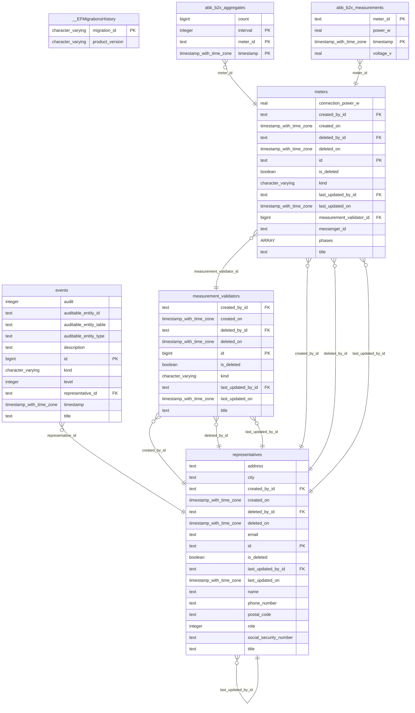

```mermaid
erDiagram
    __EFMigrationsHistory {
        character_varying migration_id PK
        character_varying product_version
    }

    abb_b2x_aggregates {
        bigint count
        integer interval PK
        text meter_id PK
        timestamp_with_time_zone timestamp PK
    }

    abb_b2x_measurements {
        text meter_id PK
        real power_w
        timestamp_with_time_zone timestamp PK
        real voltage_v
    }

    events {
        integer audit
        text auditable_entity_id
        text auditable_entity_table
        text auditable_entity_type
        text description
        bigint id PK
        character_varying kind
        integer level
        text representative_id FK
        timestamp_with_time_zone timestamp
        text title
    }

    measurement_validators {
        text created_by_id FK
        timestamp_with_time_zone created_on
        text deleted_by_id FK
        timestamp_with_time_zone deleted_on
        bigint id PK
        boolean is_deleted
        character_varying kind
        text last_updated_by_id FK
        timestamp_with_time_zone last_updated_on
        text title
    }

    meters {
        real connection_power_w
        text created_by_id FK
        timestamp_with_time_zone created_on
        text deleted_by_id FK
        timestamp_with_time_zone deleted_on
        text id PK
        boolean is_deleted
        character_varying kind
        text last_updated_by_id FK
        timestamp_with_time_zone last_updated_on
        bigint measurement_validator_id FK
        text messenger_id
        ARRAY phases
        text title
    }

    representatives {
        text address
        text city
        text created_by_id FK
        timestamp_with_time_zone created_on
        text deleted_by_id FK
        timestamp_with_time_zone deleted_on
        text email
        text id PK
        boolean is_deleted
        text last_updated_by_id FK
        timestamp_with_time_zone last_updated_on
        text name
        text phone_number
        text postal_code
        integer role
        text social_security_number
        text title
    }

    abb_b2x_aggregates }o--|| meters : "meter_id"
    abb_b2x_measurements }o--|| meters : "meter_id"
    events }o--|| representatives : "representative_id"
    measurement_validators }o--|| representatives : "created_by_id"
    measurement_validators }o--|| representatives : "deleted_by_id"
    measurement_validators }o--|| representatives : "last_updated_by_id"
    meters }o--|| measurement_validators : "measurement_validator_id"
    meters }o--|| representatives : "created_by_id"
    meters }o--|| representatives : "deleted_by_id"
    meters }o--|| representatives : "last_updated_by_id"
    representatives }o--|| representatives : "created_by_id"
    representatives }o--|| representatives : "deleted_by_id"
    representatives }o--|| representatives : "last_updated_by_id"
```
