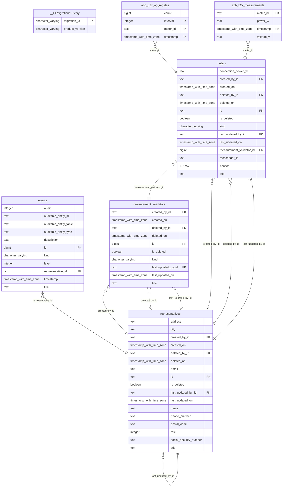
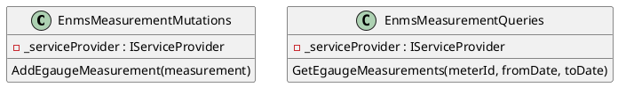

# ENMS Backend

The ENMS backend is divided into two parts. The interface with the database,
`Enms.Data`, and the core logic, `Enms.Business`.

## `Enms.Data`

The `Enms.Data` component contains entities required to interact with the
database. The entities are defined using the Entity Framework Core. The entities
inherit bases and implement interfaces to provide extra functionality but these
are not required to understand the backend. The entities directly map to tables
in the database and are as follows:

- `EgaugeMeter` - Represents an eGauge meter.
- `EgaugeMeasurement` - Represents a measurement from an eGauge meter.
- `EgaugeAggregate` - Represents an aggregate of measurements from an eGauge
  meter. These can be averages, peaks, troughs of various measures and are used
  as a "cache" for various queries we plan to add. Currently aggregates are
  stored in quarter hourly, daily and monthly intervals, but more will be added
  depending on the needs of the project.
- `EgaugeMeasurementValidator` - Represents a validator for eGauge measurements.
- `RepresentativeEntity` - Represents either a user or operator that has the
  same primary key as the user in the `OrchardCore` part of the database. These
  are meant as application users that will represent real world users and
  operators which will later be added to the database.
- `Event` - Represents an event. There are multiple subtypes of events that
  inherit from this class, but those are not yet carefully considered. These
  will be used for various ways to alert users and operators of potential
  failure.

The currently implemented database schema is as follows:



The `EgaugeMeasurement` and `EgaugeAggregate` entity tables use TimescaleDB to
optimize storage and querying of time-series data.

These entities are accessed through the `EnmsDataDbContext` class as is
described below:

```plantuml
class EnmsDataDbContext extends DbContext {
  DbSet<EgaugeMeter> EgaugeMeters
  DbSet<EgaugeMeasurement> EgaugeMeasurements
  DbSet<EgaugeAggregate> EgaugeAggregates
  DbSet<EgaugeMeasurementValidator> EgaugeMeasurementValidators
  DbSet<RepresentativeEntity> Representatives
  DbSet<Event> Events
}
```

This class can then be easily consumed by the `Enms.Business` component.

## `Enms.Business`

The `Enms.Business` component contains the core logic of the ENMS backend. The
component is divided into services that provide functionality to the frontend
and store measurements in the database. Services are spread into different
logically cohesive namespaces.

```plantuml
@startuml

start

:eGauge device pushes measurement;

:EgaugePushHandler parses measurement;

if (Measurement parsed successfully?) then (no) stop else (yes) endif

:EnmsClient stores parsed measurement;

if (Measurement stored successfully?) then (no) stop else (yes) endif

stop

@enduml
```

### `Enms.Business.Capabilities`

This namespace provides classes that will represent capabilities of different
types of meters. This is a placeholder for future development because we might
only need one type of meter but in our experience, this is unlikely because
engineers usually think they know what meter they want and when they see
measurements from a particular meter, they will want to change it. This
namespace will provide a way to easily add new meters and their capabilities.

### `Enms.Business.Models`

This namespace provides classes that represent the models of the ENMS backend.
These models are directly tied to entities in `Enms.Data` but have extra
functionality and attributes needed for conversion, validation and mathematical
operations.

### `Enms.Business.Math`

This namespace provides classes that represent different types of electrical
measures and operations on these measures which will be used for analytical
purposes.

### `Enms.Business.Conversion`

This namespace provides all the classes needed to do various conversions whether
it be conversions between aforementioned models and entities or push requests
and measurements.

### `Enms.Business.Interceptors`

This namespace provides classes that will intercept requests and responses to
`Enms.Data` and provide extra functionality like creating aggregates of
measurements. It is worthwhile to note that we could have used TimescaleDB to
create continuous aggregates but we decided against it because of licensing
issues on Azure.

### `Enms.Business.Mutations`

This namespace provides classes that mutate (add, modify, delete rows) the
database via `Enms.Data`. The reason we put these classes in a separate
namespace is because it has proven valuable for navigating throughout the
codebase and diagnosing potential causes of problems. Problems with the database
integrity are usually more severe than problems with the database load and the
former are a problem of mutations whereas the latter are a problem of queries.

### `Enms.Business.Queries`

This namespace provides classes that query the database via `Enms.Data`. The
same reasoning as for mutations applies here.



### `Enms.Business.Time`

This namespace provides a handful of functions needed to manipulate time. It has
proven exceptionally difficult to create properly working time functions just
because of the sheer amount of edge cases and we found that having these
functions tucked away neatly in a separate namespace has proven valuable.

### `Enms.Business.Iot`

This namespace provides models and classes that will be used to interact with
meters. So far, this includes push request models of the eGauge meter and logic
of parsing these into measurement models.

The modeled eGauge push request structure which is read from XML is as follows:

```plantuml
class EgaugeRegister {
  EgaugeRegisterType Type
  EgaugeRegisterUnit Unit
  decimal Value
}

enum EgaugeRegisterType {
  Irradiance,
  Frequency,
  Current,
  ReactivePower,
  Pressure,
  Power,
  VolumetricFlow,
  MassFlow,
  Resistance,
  ApparentPower,
  TotalHarmonicDistortion,
  Temperature,
  Voltage,
  Numeric,
  Monetary,
  Angle,
  RelativeHumidity,
  Speed,
  Charge
}

enum EgaugeRegisterUnit {
  WattsPerSquareMeter,
  Hertz,
  Ampere,
  VoltAmpereReactive,
  Pascal,
  Watt,
  Mm3ps,
  GramPerSecond,
  Ohm,
  VoltAmpere,
  Percent,
  Celsius,
  Volt,
  None,
  CurrencyPerSecond,
  Degrees,
  MeterPerSecond,
  AmpereHours
}

class EgaugeRegisterMap {
  Dictionary<string, EgaugeRegister> Registers
  string MeterId
  DateTime Timestamp

  decimal Power_W()
  decimal Voltage_V()
}
```

The `EgaugeRegisterMap` class is then used to directly map measures to the
`EgaugeMeasurementModel` class. We plan to add many more measures it in the
future.
