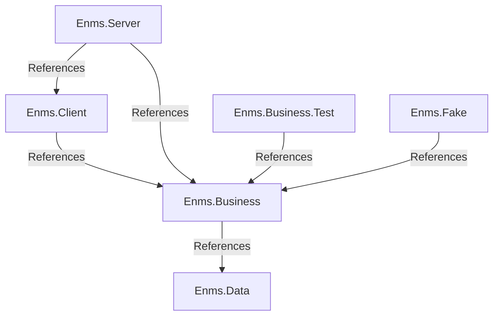

# ENMS development environment

This chapter describes the development environment for the ENMS project.

## Editors

The following editors are recommended for developing the ENMS project:

- [Visual Studio Code](https://code.visualstudio.com/)
- [Helix](https://github.com/helix-editor/helix)

Helix is a new editor that is still in development, but it is recommended for
those who want to try something new.

## Tools

The project uses a variety of tools to facilitate development:

- [Git](https://git-scm.com/) as a version control system
- [Dotnet](https://dotnet.microsoft.com/) as a runtime and SDK
- [Docker](https://www.docker.com/) for easy PostgreSQL setup
- [Just](https://github.com/casey/just) as a task runner
- [Prettier](https://prettier.io/) for code formatting
- [Pandoc](https://pandoc.org/) for converting markdown to other formats
- [Mermaid](https://mermaid-js.github.io/mermaid/#/) for creating diagrams
- [PlantUML](https://plantuml.com/) for creating diagrams

The project also uses some dotnet tools:

- [dotnet-format](https://github.com/dotnet/format) for code formatting
- [dotnet-ef](https://docs.microsoft.com/en-us/ef/core/cli/dotnet) for Entity
  Framework Core migrations
- [ReSharper Command Line Tools](https://www.jetbrains.com/help/rider/ReSharper_Command_Line_Tools.html)
  for code analysis
- [Roslynator](https://josefpihrt.github.io/docs/roslynator/cli/) for code
  analysis

## Architecture

The project is divided into several components that interface with the outside
world and one for the core logic. The components are:

- `Enms.Data` for interfacing with the PostgreSQL database
- `Enms.Client` for interfacing with the user
- `Enms.Business` for the core logic
- `Enms.Server` for the web server that sets up endpoints for user and meter
  interaction

The project also contains components for testing:

- `Enms.Business.Test` for unit tests of the core logic
- `Enms.Fake` for a fake implementation of meters

With this in mind, the project architecture is as follows:



And the outside world to component interaction is as follows:

```plantuml
cloud "Cloud" {
  package "Enms.Server " {
    portin "/iot/push/{id}" as egaugePushEndpoint
    portout "/app/{**route}" as enmsUiEndpoint

    component Enms.Business
    component Enms.Client
    component Enms.Data
  }

  database "Database (PostgreSQL)" {
    port "5432" as dbPort
  }
}

node "eGauge1" as EG1
node "eGauge2" as EG2
node "eGauge3" as EG3

node "Client1" as C1
node "Client2" as C2
node "Client3" as C3

EG1 --> egaugePushEndpoint : pushes to
EG2 --> egaugePushEndpoint : pushes to
EG3 --> egaugePushEndpoint : pushes to

enmsUiEndpoint <-- C1 : connects to
enmsUiEndpoint <-- C2 : connects to
enmsUiEndpoint <-- C3 : connects to

Enms.Data -up-> dbPort : connects to

egaugePushEndpoint --> Enms.Business : listens to
Enms.Business <.right. Enms.Client : uses

Enms.Client <-- enmsUiEndpoint : listens to
Enms.Business .left.> Enms.Data : uses
```

With this we can test the interaction between the server and meters with
`Enms.Fake`, the core logic with `Enms.Business.Test`, and the user interface is
tested manually. We may add automated tests for the user interface in the form
of E2E Playwright tests in the future.
