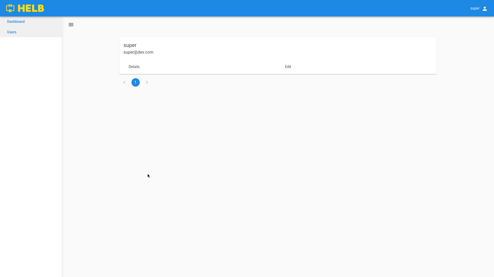

# ENMS frontend

The ENMS frontend is a Blazor SSR project that is currently under heavy
development. So far, the basic layout, navigation and a list of users that can
be edited have been implemented. As previously mentioned, the user management,
authentication and authorization is handled by `OrchardCore`, so we got that
part of the project for free.

