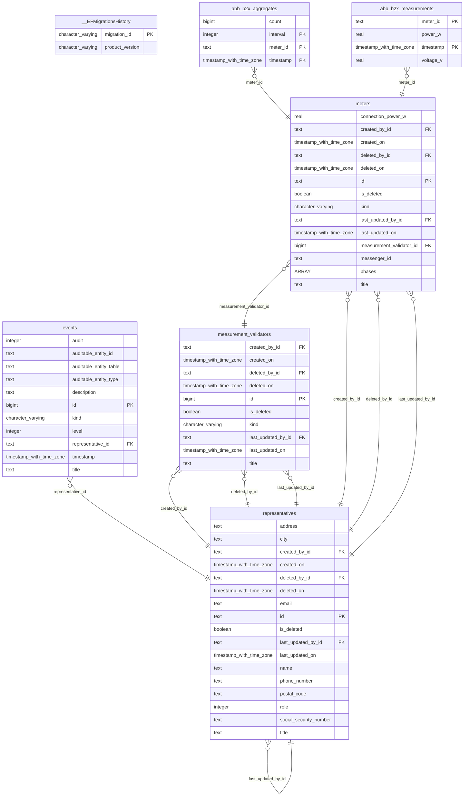
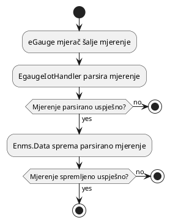
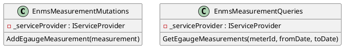

# ENMS Backend

ENMS backend je podijeljen na dva dijela. Sučelje s bazom podataka, `Enms.Data`,
i osnovna logika, `Enms.Business`.

## `Enms.Data`

Komponenta `Enms.Data` sadrži entitete potrebne za interakciju s bazom podataka.
Entiteti su definirani korištenjem Entity Framework Core-a. Entiteti nasljeđuju
bazne klase i implementiraju sučelja kako bi pružili dodatne funkcionalnosti,
ali to nije potrebno razumjeti za backend. Entiteti direktno mapiraju na tablice
u bazi podataka i to su:

- `EgaugeMeter` - Predstavlja eGauge brojilo.
- `EgaugeMeasurement` - Predstavlja mjerenje s eGauge brojila.
- `EgaugeAggregate` - Predstavlja agregatna mjerenja s eGauge brojila. To mogu
  biti prosjeci, maksimumi, minimumi različitih mjera i koriste se kao "cache"
  za razne upite prema bazi podataka koje planiramo dodati. Trenutno su
  agregatna mjerenja spremljena u petnaest minutnim, dnevnim i mjesečnim
  intervalima, ali će biti dodani još ovisno o potrebama projekta.
- `EgaugeMeasurementValidator` - Predstavlja provjeritelj valjanosti za eGauge
  mjerenja.
- `RepresentativeEntity` - Predstavlja ili korisnika ili operatora koji ima isti
  primarni ključ kao korisnik u dijelu baze podataka `OrchardCore`. Ovi su
  namijenjeni kao korisnički entiteti koji će predstavljati korisnike i
  operatore iz stvarnog svijeta koji će kasnije biti dodani u bazu podataka.
- `Event` - Predstavlja događaj. Postoji mnogo podtipova događaja koji
  nasljeđuju ovu klasu, ali ti još nisu pažljivo razmotreni. Koristit će se za
  različite načine obavještavanja korisnika i operatora o mogućim greškama.

Trenutno implementirana shema baze podataka je kako slijedi:



Tablice entiteta `EgaugeMeasurement` i `EgaugeAggregate` koriste TimescaleDB za
optimizaciju pohrane i upita mjerenja.

Na ove entitete se pristupa putem klase `EnmsDataDbContext` kako je opisano u
nastavku:

```plantuml
class EnmsDataDbContext extends DbContext {
  DbSet<EgaugeMeter> EgaugeMeters
  DbSet<EgaugeMeasurement> EgaugeMeasurements
  DbSet<EgaugeAggregate> EgaugeAggregates
  DbSet<EgaugeMeasurementValidator> EgaugeMeasurementValidators
  DbSet<RepresentativeEntity> Representatives
  DbSet<Event> Events
}
```

Ovu klasu zatim lako može koristiti komponenta `Enms.Business`.

## `Enms.Business`

Komponenta `Enms.Business` sadrži osnovnu logiku ENMS backenda. Komponenta je
podijeljena na usluge koje pružaju funkcionalnosti frontendu i pohranjuju
mjerenja u bazu podataka. Usluge su raspoređene u različite logički koherentne
pakete.



### `Enms.Business.Capabilities`

Ovaj paket pruža klase koje će predstavljati sposobnosti različitih vrsta
brojila. Ovo je mjesto za budući razvoj jer možda ćemo trebati samo jednu vrstu
brojila, ali prema našem iskustvu, to je malo vjerojatno jer inženjeri obično
misle da znaju koje brojilo žele i kada vide mjerenja s određenog brojila, htjet
će ga promijeniti. Ovaj paket pružit će način za lako dodavanje novih brojila i
njihovih sposobnosti.

### `Enms.Business.Models`

Ovaj paket pruža klase koje predstavljaju modele ENMS backenda. Ti modeli su
izravno povezani s entitetima u `Enms.Data`, ali imaju dodatne funkcionalnosti i
atribute potrebne za konverziju, provjeru valjanosti i matematičke operacije.

### `Enms.Business.Math`

Ovaj paket pruža klase koje predstavljaju različite vrste električnih mjera i
operacija na tim mjerama koje će se koristiti u analitičke svrhe.

### `Enms.Business.Conversion`

Ovaj paket pruža sve klase potrebne za različite konverzije, bilo da se radi o
konverzijama između spomenutih modela i entiteta ili zahtjeva za push i
mjerenja.

### `Enms.Business.Interceptors`

Ovaj paket pruža klase koje će presretati zahtjeve i odgovore prema `Enms.Data`
i pružiti dodatne funkcionalnosti poput stvaranja agregatnih mjerenja. Valja
napomenuti da smo mogli koristiti TimescaleDB za stvaranje kontinuiranih
agregata, ali smo se odlučili protiv toga zbog problema s licenciranjem na
Azure-u.

### `Enms.Business.Mutations`

Ovaj paket pruža klase koje mutiraju (dodaju, mijenjaju, brišu retke) bazu
podataka putem `Enms.Data`. Razlog zašto smo stavili ove klase u poseban paket
je jer se pokazalo korisnim za snalaženje kroz kôd i dijagnosticiranje
potencijalnih uzroka problema. Problemi s integritetom baze podataka obično su
ozbiljniji od problema s opterećenjem baze podataka, a prvi su problem mutacija
dok su drugi problemi upita.

### `Enms.Business.Queries`

Ovaj paket pruža klase koje upituju bazu podataka putem `Enms.Data`. Isti
razlozi kao i za mutacije vrijede i ovdje.



### `Enms.Business.Time`

Ovaj paket pruža nekoliko funkcija potrebnih za manipulaciju vremenom. Pokazalo
se izuzetno teško stvoriti ispravno funkcionirajuće funkcije vremena zbog
ogromnog broja "edge case-ova" i složili se da je imati ove funkcije uredno
pohranjene u zaseban paket korisno.

### `Enms.Business.Iot`

Ovaj paket pruža modele i klase koje će se koristiti za interakciju s
brojiloima. Za sada, to uključuje modele zahtjeva za push eGauge brojila i
logiku za parsiranje tih zahtjeva u modele mjerenja.

Modelirana struktura zahtjeva za push eGauge brojiloa koja se čita iz XML-a je
kako slijedi:

```plantuml
class EgaugeRegister {
  EgaugeRegisterType Type
  EgaugeRegisterUnit Unit
  decimal Value
}

enum EgaugeRegisterType {
  Irradiance,
  Frequency,
  Current,
  ReactivePower,
  Pressure,
  Power,
  VolumetricFlow,
  MassFlow,
  Resistance,
  ApparentPower,
  TotalHarmonicDistortion,
  Temperature,
  Voltage,
  Numeric,
  Monetary,
  Angle,
  RelativeHumidity,
  Speed,
  Charge
}

enum EgaugeRegisterUnit {
  WattsPerSquareMeter,
  Hertz,
  Ampere,
  VoltAmpereReactive,
  Pascal,
  Watt,
  Mm3ps,
  GramPerSecond,
  Ohm,
  VoltAmpere,
  Percent,
  Celsius,
  Volt,
  None,
  CurrencyPerSecond,
  Degrees,
  MeterPerSecond,
  AmpereHours
}

class EgaugeRegisterMap {
  Dictionary<string, EgaugeRegister> Registers
  string MeterId
  DateTime Timestamp

  decimal Power_W()
  decimal Voltage_V()
}
```

Klasa `EgaugeRegisterMap` zatim se koristi za izravno mapiranje mjera na klasu
`EgaugeMeasurementModel`. Planiramo dodati mnogo više mjera u budućnosti.
