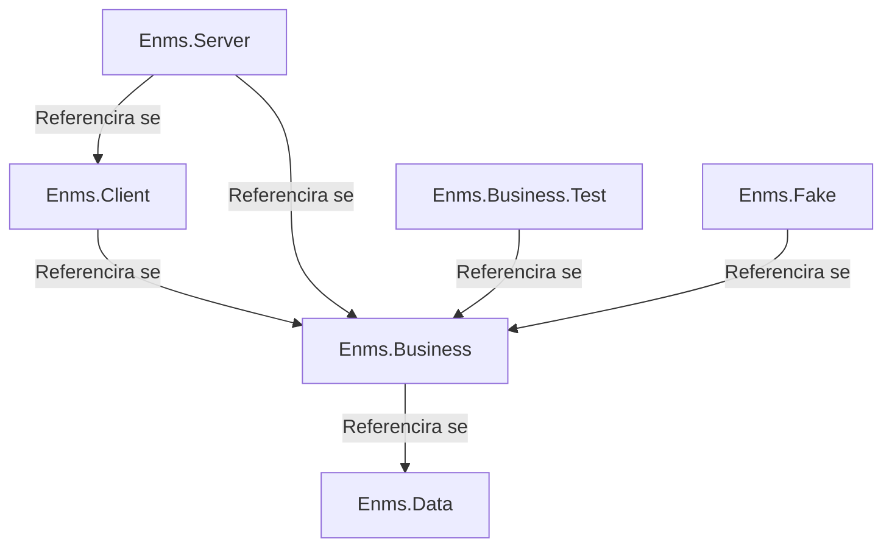

# ENMS razvojno okruženje

Ovo poglavlje opisuje razvojno okruženje za ENMS projekt.

## Uređivači teksta

Preporučeni uređivači teksta za razvoj ENMS projekta su:

- [Visual Studio Code](https://code.visualstudio.com/)
- [Helix](https://github.com/helix-editor/helix)

Helix je novi uređivač teksta koji je još uvijek u razvoju, ali preporučuje se
onima koji žele isprobati nešto novo.

## Alati

Projekt koristi različite alate radi olakšanja razvoja:

- [Git](https://git-scm.com/) kao sustav za kontrolu verzija
- [Dotnet](https://dotnet.microsoft.com/) kao runtime i SDK
- [Docker](https://www.docker.com/) za jednostavno postavljanje PostgreSQL baze
  podataka
- [Just](https://github.com/casey/just) kao alat za pokretanje skripti
- [Prettier](https://prettier.io/) za formatiranje koda
- [Pandoc](https://pandoc.org/) za pretvaranje Markdown u druge formate
- [Mermaid](https://mermaid-js.github.io/mermaid/#/) za izradu dijagrama
- [PlantUML](https://plantuml.com/) za izradu dijagrama

Projekt također koristi neke dotnet alate:

- [dotnet-format](https://github.com/dotnet/format) za formatiranje koda
- [dotnet-ef](https://docs.microsoft.com/en-us/ef/core/cli/dotnet) za Entity
  Framework Core migracije
- [ReSharper Command Line Tools](https://www.jetbrains.com/help/rider/ReSharper_Command_Line_Tools.html)
  za analizu koda
- [Roslynator](https://josefpihrt.github.io/docs/roslynator/cli/) za analizu
  koda

## Arhitektura

Projekt je podijeljen na nekoliko komponenti koje komuniciraju s vanjskim
svijetom i jednu za osnovnu logiku. Komponente su:

- `Enms.Data` za komunikaciju s PostgreSQL bazom podataka
- `Enms.Client` za komunikaciju s korisnikom
- `Enms.Business` za osnovnu logiku
- `Enms.Server` za web server koji postavlja endpointe za interakciju s
  korisnicima i mjeračima

Projekt također sadrži komponente za testiranje:

- `Enms.Business.Test` za unit testove osnovne logike
- `Enms.Fake` za lažnu implementaciju mjerača

S obzirom na to, arhitektura projekta je sljedeća:



A interakcija s vanjskim svijetom i komponentama je sljedeća:

```plantuml
cloud "Cloud" {
  package "Enms.Server " {
    portin "/iot/push/{id}" as egaugePushEndpoint
    portout "/app/{**route}" as enmsUiEndpoint

    component Enms.Business
    component Enms.Client
    component Enms.Data
  }

  database "Baza podataka (PostgreSQL)" {
    port "5432" as dbPort
  }
}

node "eGauge1" as EG1
node "eGauge2" as EG2
node "eGauge3" as EG3

node "Klijent1" as C1
node "Klijent2" as C2
node "Klijent3" as C3

EG1 --> egaugePushEndpoint : šalje na
EG2 --> egaugePushEndpoint : šalje na
EG3 --> egaugePushEndpoint : šalje na

enmsUiEndpoint <-- C1 : povezuje se na
enmsUiEndpoint <-- C2 : povezuje se na
enmsUiEndpoint <-- C3 : povezuje se na

Enms.Data -up-> dbPort : povezuje se na

egaugePushEndpoint --> Enms.Business : osluškuje
Enms.Business <.right. Enms.Client : koristi

Enms.Client <-- enmsUiEndpoint : osluškuje
Enms.Business .left.> Enms.Data : koristi
```

S ovime možemo testirati interakciju između servera i mjerača s `Enms.Fake`,
osnovnu logiku s `Enms.Business.Test`, a korisničko sučelje se testira ručno. U
budućnosti možemo dodati automatske testove za korisničko sučelje u obliku E2E
Playwright testova.
